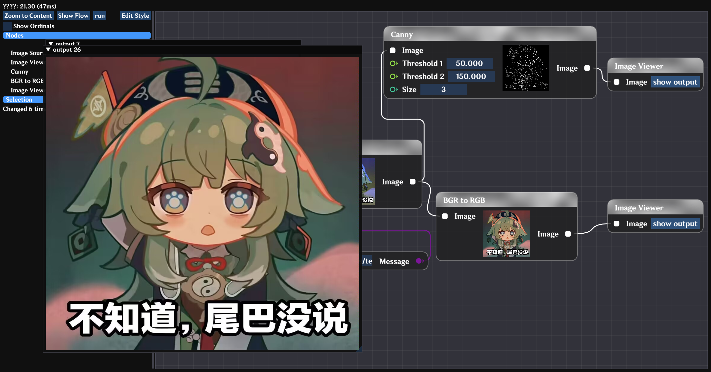

# Preview: 
A pipeline like image algorithm editor, in order to adjust algorithm parameters in real-time, adjust algorithm content, edit algorithms, and attempt to use it as a pipeline

# Download

[Nightly Build](https://github.com/GengGode/image-node-editor/releases/latest)

[Pre-Release](https://github.com/GengGode/image-node-editor/releases)

# Build

Because the opencv compilation script is already built-in, cmake can be directly launched, but the first build will consume a lot of time for opencv construction

now, you only need cmake can build it.

# Wait Fix:
- [ ] Chaos!

# View

# features:

- [ ] refactor: node and link classes 
- [ ] refactor: execute changed to mutiple threads
    as: every node has a thread to execute, but only some nodes are executed. 
        some nodes has all input parameters, it will be executed.
        nodes linked save the signal to child nodes.
        child nodes will be executed when all input parameters are ready.
- [ ] feature: some stl containers will as node input output parameters
    as: vector, list, map, set
- [ ] feature: some opencv type will as parameters
    as: Mat(over), Point, Rect, Size, Scalar, KeyPoint, DMatch
        and std::vector<cv::KeyPoint>
- [ ] feature: more and more opencv algorithms will be added
    as: cv::resize, cv::cvtColor, cv::threshold, cv::blur, cv::GaussianBlur, cv::medianBlur, cv::Sobel, cv::Scharr, cv::Laplacian, cv::Canny, cv::HoughLines, cv::HoughLinesP, cv::HoughCircles, cv::remap, cv::flip, cv::warpAffine, cv::warpPerspective, cv::integral
- [ ] ui: need support imgui-docking
- [ ] ui: node ui redraw, pin rect change

